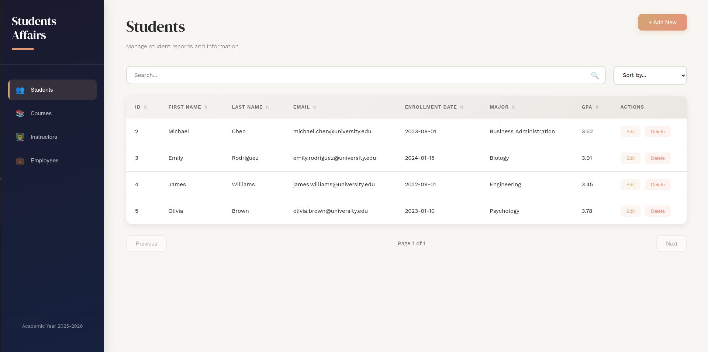
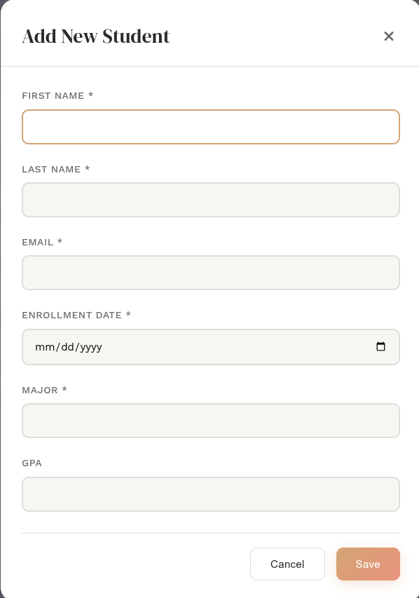

# Students Affairs System

A modern, full-featured web application for managing student affairs data including students, courses, instructors, and employees. Built with vanilla JavaScript ES6 using OOP principles and json-server as a mock backend.

## 🎯 Features

### Core Functionality
- **CRUD Operations**: Create, Read, Update, and Delete records
- **Search**: Real-time search across all record fields
- **Sort**: Sort data by any column (ascending/descending)
- **Pagination**: Navigate through data page by page (10 items per page)
- **Responsive Design**: Works seamlessly on desktop and mobile devices

### Technical Features
- Object-Oriented Programming with ES6 Classes
- Modular architecture with separate concerns
- Fetch API for all HTTP requests
- json-server as REST API backend
- Professional UI with smooth animations
- Form validation

## 📁 Project Structure

```
students-affairs-system/
├── index.html              # Main HTML file
├── styles.css              # Complete styling
├── db.json                 # JSON database
├── js/
│   ├── app.js              # Main application class
│   ├── config/
│   │   └── EntityConfig.js # Entity definitions
│   ├── services/
│   │   └── DataService.js  # API service class
│   └── ui/
│       └── UIManager.js    # UI management class
└── README.md               # This file
```

## 🚀 Getting Started

### Prerequisites
- Node.js (v14 or higher)
- npm (comes with Node.js)

### Installation

1. **Install json-server globally**
   ```bash
   npm install -g json-server
   ```

2. **Navigate to the project directory**
   ```bash
   cd students-affairs-system
   ```

3. **Start json-server**
   ```bash
   json-server --watch db.json --port 3000
   ```

4. **Open the application**
   - Open `index.html` in your browser, or
   - Use a local server (recommended):
     ```bash
     # If you have Python installed:
     python -m http.server 8000
     
     # Or using Node.js:
     npx http-server -p 8000
     ```
   - Navigate to `http://localhost:8000`

## 📘 Usage Guide

### Viewing Records
1. Click on any entity in the sidebar (Students, Courses, Instructors, or Employees)
2. Records will be displayed in a table format
3. Use pagination buttons to navigate through pages

### Adding New Records
1. Click the "Add New" button in the top-right corner
2. Fill in the form fields (fields marked with * are required)
3. Click "Save" to create the record

### Editing Records
1. Click the "Edit" button on any table row
2. Modify the form fields
3. Click "Save" to update the record

### Deleting Records
1. Click the "Delete" button on any table row
2. Confirm the deletion in the popup dialog
3. The record will be permanently removed

### Searching Records
1. Type keywords in the search box
2. Results will be filtered in real-time
3. Clear the search box to see all records

### Sorting Records
1. Select a field and order from the "Sort by" dropdown
2. Data will be reordered automatically
3. Select "Sort by..." to reset the sort
4. Or you can simply press on the column name and the records will be sorted.

## 🏗️ Architecture

### Class-Based OOP Structure

#### App Class (`app.js`)
- Main application controller
- Manages application state
- Coordinates between services and UI
- Handles all user interactions

#### DataService Class (`services/DataService.js`)
- Handles all API communications
- Methods for CRUD operations:
  - `getAll()` - Fetch all records with optional filters
  - `getById()` - Fetch single record
  - `create()` - Create new record
  - `update()` - Update existing record (PUT)
  - `patch()` - Partial update (PATCH)
  - `delete()` - Delete record
  - `search()` - Search records
  - `sort()` - Sort records

#### UIManager Class (`ui/UIManager.js`)
- Manages all UI operations
- Modal management
- Form generation
- Loading states
- Empty states

#### EntityConfig (`config/EntityConfig.js`)
- Defines structure for each entity type
- Field configurations including:
  - Data types
  - Validation rules
  - Display properties
  - Sortability

## 🎨 Design Features

### Visual Design
- Editorial-inspired aesthetic with DM Serif Display font
- Warm color palette (bronze/terracotta accents)
- Smooth animations and transitions
- Professional gradient backgrounds
- Refined typography with attention to spacing

### User Experience
- Intuitive navigation
- Clear visual feedback
- Loading indicators for async operations
- Confirmation dialogs for destructive actions
- Responsive design for all screen sizes

## 🔧 API Endpoints

json-server provides the following REST API endpoints:

### Get All Records
```
GET /students
GET /courses
GET /instructors
GET /employees
```

### Get Single Record
```
GET /students/{id}
GET /courses/{id}
GET /instructors/{id}
GET /employees/{id}
```

### Create Record
```
POST /students
POST /courses
POST /instructors
POST /employees
```

### Update Record
```
PUT /students/{id}
PUT /courses/{id}
PUT /instructors/{id}
PUT /employees/{id}
```

### Delete Record
```
DELETE /students/{id}
DELETE /courses/{id}
DELETE /instructors/{id}
DELETE /employees/{id}
```

### Query Parameters
- `_page` - Page number for pagination
- `_limit` - Items per page
- `q` - Full-text search
- `_sort` - Sort by field
- `_order` - Sort order (asc/desc)

Example: `GET /students?_page=1&_limit=10&_sort=lastName&_order=asc`

## 📊 Data Models

### Student
- firstName, lastName, email
- enrollmentDate, major, gpa

### Course
- courseCode, courseName, credits
- department, semester, description

### Instructor
- firstName, lastName, email
- department, title, officeNumber, phone

### Employee
- firstName, lastName, email
- position, department, hireDate, phone

## 🔐 Data Persistence

All data is stored in `db.json` file. This file acts as a database for json-server. Any changes made through the UI will persist in this file automatically.

To reset the database, simply restore the original `db.json` file.

## 🖼️ Screenshots
<table>
<tr>
<td></td>
</tr>
<tr>
<td></td>
</tr>
</table>


## Demo
https://drive.google.com/file/d/17G3LGv8SZYkHC2ED74egp3NmlJqJJrfw/view?usp=sharing